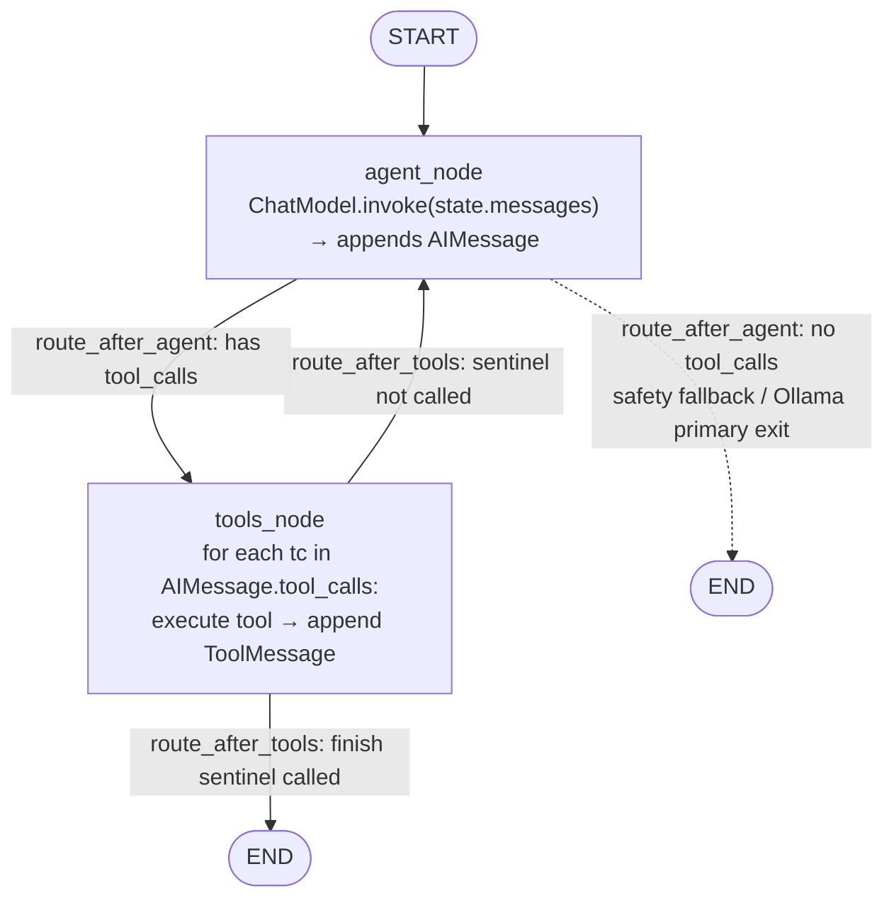

# translate-v3

Agentic Java → Elixir translator. Third iteration of the tool; agent-first
architecture built on LangGraph + LangChain, with tool use, prompt caching
(Anthropic), dependency-aware coordination, and structurally-enforced completion
via `tool_choice="any"` + sentinel tools (`finish_translate`, `finish_polish`).

**Status:** LangGraph migration complete — all phases shipped on LangGraph +
LangChain with multi-provider support (Anthropic / OpenAI / Ollama / LM Studio;
swap via config, no code changes). 207 unit tests passing. Regression baseline
captured: 92% symbol coverage / 100% test parity on joda-money; fast-uuid smoke
passed on Anthropic and OpenAI; Ollama plumbing smoke passed. See
[`PLAN_LANGGRAPH.md`](PLAN_LANGGRAPH.md) for the migration design and
[`REVIEW_PROVIDER_AGNOSTICISM.md`](REVIEW_PROVIDER_AGNOSTICISM.md) for the
provider-abstraction audit. [`PLAN.md`](PLAN.md) documents the original
Anthropic-native v3 architecture (historical reference + §17 for implementation
deltas).

## What it does

Point it at a Java project + an output path. It:

1. **Scaffolds** a fresh Elixir project (`mix new` + Credo + `.tool-versions` + `priv/` with your classpath resources; also copies LICENSE / NOTICE and updates `.gitignore`)
2. **Discovers** the Java source tree, builds a topological dep graph, seeds a per-file state machine
3. **Translates** through an agentic loop under `tool_choice="any"` — the model translates classes one at a time, verifying with `mix compile --warnings-as-errors`, `mix format`, `mix credo`. Session ends only when the model explicitly calls `finish_translate(summary)` (which itself refuses if any file is still non-terminal)
4. **Polishes** (optional, automatic if credo is red) — one additional session with a curated tool set + `finish_polish` sentinel, cleaning up mechanical warnings (alias order, predicate naming, complexity refactors)
5. **Rewrites README** with valid Elixir code examples grounded against the actual translated API (one-shot, non-fatal)
6. **Generates ExUnit tests** (Phase B, opt-in via `--phase B` / `--phase both`) — per-file JUnit → ExUnit conversion, verified with `mix test`, one retry on failure
7. **Persists everything** to `.translate_v3_state/` — resumable, auditable, cost-tracked. Polish state cached so subsequent `--resume` skips no-op work.

## Requirements

- **Python 3.11+** (stdlib `tomllib`)
- **Elixir 1.17+ / OTP 26+** — asdf-managed preferred; PATH and brew fallbacks
- **LangChain packages** — pinned in `requirements.txt`:
  `langchain-core`, `langchain-anthropic`, `langchain-openai`, `langchain-ollama`,
  `langgraph`
- **`python-dotenv`** — `main.py` loads `.env` automatically at startup
- **Provider API key** in the environment or in `translate_v3/.env` (or `--dry-run`
  for a no-cost scaffold + plan smoke test):
  - Anthropic: `ANTHROPIC_API_KEY`
  - OpenAI / LM Studio: `OPENAI_API_KEY`
  - Ollama: no key needed (local)

## Quick start

```bash
pip install -r requirements.txt
```

Provider is selected via a TOML config file — one config line, one command. Four
sample configs live at the repo root:

### Anthropic (default)

```bash
# Put ANTHROPIC_API_KEY=sk-ant-... in translate_v3/.env — main.py auto-loads it
cp translate.anthropic.toml my.toml

# Smoke test (no API calls) — verify scaffold works end-to-end
python main.py /path/to/java/project /path/to/output --config my.toml --dry-run

# Real run — joda-money
python main.py /var/www/training/joda-money /var/www/training/joda-money-v3 \
    --app-name joda_money --module-name JodaMoney --config translate.anthropic.toml --verbose
```

### OpenAI

```bash
# Put OPENAI_API_KEY=sk-... in .env
python main.py /path/to/java /path/to/output --config translate.openai.toml --dry-run
```

### Ollama (local, no API key)

```bash
# ollama serve must be running; model must be pulled first
# ollama pull devstral-small-2:24b  (or the model named in the TOML)
python main.py /path/to/java /path/to/output --config translate.ollama.toml --dry-run
```

### LM Studio (or any OpenAI-compatible endpoint)

```bash
# LM Studio server on :1234; set OPENAI_API_KEY=lm-studio (any string)
python main.py /path/to/java /path/to/output --config translate.lmstudio.toml --dry-run
```

See [Provider configuration](#provider-configuration) for the capability matrix and
per-provider knob reference.

Rough cost/time (Opus 4.7 with adaptive thinking, verified on real runs):
- **fast-uuid** (1 class): ~$1.64, ~84 sec (adaptive thinking premium; cache hits 31%)
- **joda-money** (23 classes): ~$5–8 fresh, ~$0.30 clean resume, 5–10 min wall time
- **java-string-similarity** (~25 classes): ~$5–10 with polish, ~5–10 min
- **OpenAI / Ollama**: cost varies by model; set `cost_zero = true` in config for local models

## Provider configuration

The provider is the only thing that changes between configs. No code edits needed —
swap the TOML, set the matching API key. See
[`REVIEW_PROVIDER_AGNOSTICISM.md`](REVIEW_PROVIDER_AGNOSTICISM.md) for the audit
and design rationale behind this isolation.

| Provider | Sample config | `tool_choice` enforced | Prompt caching | Adaptive thinking | Cost profile |
|---|---|---|---|---|---|
| Anthropic | [`translate.anthropic.toml`](translate.anthropic.toml) | Yes (`{"type":"any"}`) | Yes — system prompt + tool schemas | Yes (`thinking: adaptive`) | ~$15–25/M out (Opus 4.7) |
| OpenAI | [`translate.openai.toml`](translate.openai.toml) | Yes (`"required"`) | Server-side automatic (not surfaced in cost report) | No — use `reasoning_effort` instead | ~$0.25–1.25/M in, $2–10/M out (gpt-5 family) |
| Ollama | [`translate.ollama.toml`](translate.ollama.toml) | No (ChatOllama ignores `tool_choice`) | No | No | Free (local) |
| LM Studio / vLLM / OpenRouter | [`translate.lmstudio.toml`](translate.lmstudio.toml) | Yes (via OpenAI builder) | No | No | Free or cost_zero=true |

All provider-specific knowledge is isolated in `agent/llm.py`. Callers see a
plain `BaseChatModel` and a `ChatModelBundle` — no provider branches in
`translator.py`, `graph.py`, or anywhere else in the agent layer.

### Provider-specific config knobs

| Key | Provider | Purpose |
|---|---|---|
| `llm.base_url` | OpenAI / Ollama | Override API endpoint (LM Studio: `http://localhost:1234/v1`) |
| `llm.reasoning_effort` | OpenAI GPT-5 | `"minimal"` / `"low"` / `"medium"` / `"high"` |
| `llm.num_ctx` | Ollama | Override context window (fixes 400 on large prompts) |
| `llm.num_predict` | Ollama | Cap per-turn output tokens |
| `llm.cost_zero` | Any | Silence "unknown model" warning for local/custom model names |
| `agent.thinking_budget_tokens` | Anthropic | `0` = adaptive (recommended); `>0` = hard token cap |

Unknown-provider or custom model names fall back to zero cost (warn once) so
runs are never blocked by a missing pricing entry. Add new models to
`agent/cost.py:MODEL_PRICING` to get accurate accounting.

## CLI

Two required positional args, everything else optional.

```
python main.py SOURCE_ROOT TARGET_ROOT [flags]
```

**Precedence:** CLI flag > config file > defaults.

| Flag | Purpose |
|---|---|
| `--config FILE.toml` | Optional TOML config for advanced tuning |
| `--app-name NAME` | Override mix app name (default: derived by `mix new`) |
| `--module-name NAME` | Override top-level Elixir module |
| `--model MODEL` | Override translation model (default: `claude-opus-4-7`) |
| `--max-budget-tokens N` | Total token budget (default: 3M; minimum 20K for Task Budgets) |
| `--phase A/B/both` | A=translate, B=tests, both. Default: A |
| `--dry-run` | Scaffold + print plan, no API calls |
| `--resume` | Pick up from `.translate_v3_state/`; skip completed files |
| `--verbose` | Stream every event to stdout (default: summary only) |
| `--skip-format` / `--skip-credo` | Skip specific validation stages |
| `--strict-validation` | Treat any Credo warning as fatal (default: `:high`+ only) |
| `--skip-readme` | Don't rewrite README after Phase A (useful on resume when README already generated) |
| `--run-regression` | After translation, score against gold reference set |

## Resume from a crash

```bash
python main.py /var/www/training/joda-money /var/www/training/joda-money-v3 \
    --app-name joda_money --module-name JodaMoney --resume
```

`--resume` requires an existing target with `mix.exs` and `.translate_v3_state/`.
Already-COMPLETE / SKIPPED / ESCALATED files stay put; work resumes on the rest.

## Sample run output

Successful joda-money run tail:

```
[HH:MM:SS] info opening polish session #2: format=✓ credo=✗ (tool_choice=any; must call finish_polish to end)
[HH:MM:SS] tool read_elixir money_utils.ex
[HH:MM:SS] tool edit_elixir money_utils.ex (rename is_negative → negative?)
[HH:MM:SS] tool grep_elixir "is_negative"
[HH:MM:SS] tool edit_elixir big_money.ex  (call-site update)
[HH:MM:SS] tool mix_compile_tool → exit=0
[HH:MM:SS] tool mix_credo_tool → exit=0
[HH:MM:SS] tool finish_polish (unfixable=3)
[HH:MM:SS] info polish session #2 ended: finish_polish (edits: 14; unfixable declared: 3)
[HH:MM:SS] phase_start translating README.md → ...
[HH:MM:SS] phase_end wrote README.md (114 lines, cost $0.10)

━━━━━━━━━━━━━━━━━━━━━━━━━━━━━━━━━━━━━━━━━━━━━━━━━━━━━━━━━━━━
  RUN SUMMARY
━━━━━━━━━━━━━━━━━━━━━━━━━━━━━━━━━━━━━━━━━━━━━━━━━━━━━━━━━━━━
  Wall time:        5m 12s
  Total cost:       $5.42 USD
    input           $2.11  (421k tokens)
    output          $2.87  (155k tokens)
    cache_write     $0.19  (30k tokens)
    cache_read      $0.25  (498k tokens)
  Cache hit rate:   54.2%
  Sessions:         3  (2 checkpoints)
  Budget used:      22%  ($5.42 / $25.00)

  Files translated:  20
  Files skipped:      3  (Ser, CurrencyUnitDataProvider, DefaultCurrencyUnitDataProvider)
  Files escalated:    0
  Blocked downstream: 0
  Validation:  compile ✓  format ✓  credo ✓
━━━━━━━━━━━━━━━━━━━━━━━━━━━━━━━━━━━━━━━━━━━━━━━━━━━━━━━━━━━━
```

Subsequent `--resume` on the same target hits the polish state cache and
finishes in ~5 seconds at $0.00 cost.

## Architecture

```
main.py                     CLI + orchestration + Phase A/B/README wiring
├── project/
│   ├── config.py           TOML loading, CLI precedence, validation warnings
│   ├── mix_env.py          asdf/PATH/brew Elixir toolchain discovery
│   ├── scaffold.py         mix new + Credo + priv/ + LICENSE copy + .gitignore patch
│   ├── deps.py             topological levels + SCC (cycle) detection
│   └── naming.py           camel_to_snake, sanitize_app_name (shared)
├── agent/
│   ├── llm.py              LLM factory (build_chat_model → ChatModelBundle),
│   │                       classify_exception (provider-agnostic exception routing)
│   ├── graph.py            LangGraph StateGraph builders — build_translation_graph,
│   │                       build_polish_graph; agent_node, tools_node, routing fns
│   ├── state.py            9-state file machine, atomic JSON persistence
│   ├── cost.py             per-model pricing, dollar-based budget, per-file report
│   ├── events.py           thread-safe JSONL event stream + heartbeat thread
│   ├── summary.py          end-of-run scorecard
│   ├── mix_ops.py          mix compile/format/credo/test with bomb-warning detection
│   ├── session_ctx.py      shared context object for tools
│   ├── tools.py            14 tools main / 10 tools polish (see below)
│   │                       decorated with @tool from langchain_core
│   ├── translator.py       multi-session loop driving graph.stream(); sentinel
│   │                       handling, polish, synth — wraps the LangGraph subgraphs
│   ├── readme_translator.py  Post-Phase-A README rewriter (one-shot, non-agent)
│   └── test_writer.py      Phase B — JUnit → ExUnit converter (per-file, non-agent)
├── language/
│   ├── java.py             package/dep discovery, test-file matching
│   └── elixir.py           module shape parsing (name/kind/fields/functions)
├── prompts/                system prompts in markdown (hot-reloadable):
│   ├── translator_system.md      Phase A translation
│   ├── readme_system.md          README rewrite (anti-hallucination grounded)
│   └── test_writer_system.md     JUnit → ExUnit mapping table
└── tests/
    ├── gold/               hand-verified reference modules + ExUnit tests
    ├── regression/         scorer: symbol coverage, test parity, style
    └── unit/               207 tests, all green
```

### Agent graph

Both `translation_graph` and `polish_graph` share the same topology — an
`agent ↔ tools` cycle with a sentinel-tool exit. The diagram below is
hand-written to match the implementation in `agent/graph.py` with routing
labels; the auto-generated version (`graph.get_graph().draw_mermaid()`)
omits the condition labels.



The two graphs differ only in the bound tool set and the sentinel name:

| | `translation_graph` | `polish_graph` |
|---|---|---|
| Tools | 14 (includes write_elixir, delete_elixir, finish_translate) | 10 (read/edit/verify subset + finish_polish) |
| Sentinel | `finish_translate` | `finish_polish` |

`SessionContext` (config, scaffold, StateStore, EventStream, CostReport,
budget) is bound into tool functions as a closure at graph build time — not
stored in `AgentState`. `AgentState` is session-scoped and dropped after each
graph run (session-reset is deliberate context loss, not a checkpointer
scenario — see `PLAN_LANGGRAPH.md §8`).

## Tools

Two tool sets depending on mode. Main-mode has 14; polish is a curated
subset of 10 focused on style cleanup.

**Read** (no side effects): `list_files`, `read_java`, `read_elixir`,
`grep_elixir`, `describe_module`.

- Three gradients of Elixir reads by cost: `describe_module` returns just
  API surface (cheap, for files > 500 lines); `grep_elixir` for substring
  search across `lib/` (cheapest for finding call sites of a rename);
  `read_elixir` returns full source when both context and detail matter.

**Write** (side effect + syntax check baked in): `write_elixir`,
`edit_elixir`, `delete_elixir`.

- `write_elixir` for first-time file creation (~5K–15K output tokens).
- `edit_elixir` for surgical unique-match replacements (~50–500 tokens,
  the invariant matches Claude Code — `old_string` must be exactly one
  occurrence). Failed syntax → auto-revert; file state unchanged.
- All file tools accept both module name (`"JodaMoney.BigMoney"`) and lib
  path (`"lib/joda_money/big_money.ex"`) via the same `module_or_path`
  parameter.

**Verify** (idempotent): `mix_compile_tool`, `mix_format_tool`,
`mix_credo_tool`, `validation_status`.

- `validation_status` runs all three and **promotes IN_PROGRESS → COMPLETE
  on green compile** as a side effect. So calling it acts as both a check
  and a batch state-transition.

**Escalate**: `escalate` — mark file as unresolvable; blocks all
transitively-dependent downstream files.

**Sentinels — the only way to end a session:**
- `finish_translate(summary)` — Phase A. Refuses if any file is
  non-terminal.
- `finish_polish(summary, unfixable_warnings)` — polish loop. Model
  declares which credo warnings it left unfixed and why.

Both sentinel tools return `Command(update={finish_called, finish_summary, ...}, goto=END)`
via LangGraph state — the tools_node detects this, pairs a ToolMessage with
every tool_call in the batch (preserving the tool_use/tool_result pairing
invariant), and routes the graph to END.

### Why sentinel tools + `tool_choice="any"`

The model cannot emit `end_turn` on its own — the API enforces at least
one tool call per turn. The only legitimate exit is via a sentinel, which
validates preconditions at the tool boundary (non-terminal files check,
mechanical-fix attempts check). This eliminates two failure classes we
observed with the naive `output_format=TranslationOutcome` approach:

1. Model "declaring victory" mid-work with a text-only response
2. `pydantic.ValidationError` crashes when model emits an empty text
   block (adaptive-thinking edge case on long sessions)

See PLAN.md §17.7 for the full evolution.

## Key design decisions

- **LangGraph StateGraph for edge-driven flow.** The two agentic loops
  (translation and polish) are `StateGraph` instances. Adding a new step is
  one node + two edges — no surgery on a 200-line `while True` loop. Pure
  Python orchestration wraps the graphs for multi-session, rate-limit, budget,
  and heartbeat concerns (straight-line pipelines don't benefit from a graph).
- **LangChain `ChatModel` abstraction for provider portability.** All LLM
  calls go through `BaseChatModel.invoke()` or `bind_tools(...).invoke()`.
  Provider selection is `[llm] provider = "..."` in config. No provider
  branches in `translator.py`, `graph.py`, or the tools layer.
- **Provider knowledge isolated in `agent/llm.py`.** The factory
  (`build_chat_model`), the provider-specific kwargs, and
  `classify_exception` (which maps Anthropic / OpenAI / httpx exceptions to
  a common `ExceptionKind` enum) all live here. No leakage into the graph,
  translator, or cost layer. New provider = new `_build_*` function + pricing
  entry in this one file.
- **Provider-agnostic exception classification via `classify_exception`.**
  OpenAI `RateLimitError`, Anthropic `RateLimitError`, and httpx `ReadTimeout`
  all land as `ExceptionKind.RATE_LIMIT` → same retry/backoff path.
  Previously, non-Anthropic errors fell through to `parse_failure` and killed
  runs on the first transient failure.
- **Structural completion via `tool_choice="any"` + sentinel tools.** The
  headline pattern. Model physically cannot emit `end_turn` — it must call
  a tool every turn, and only `finish_translate` / `finish_polish` can end
  the session. Sentinel tools validate preconditions at their own
  boundary (Pydantic types + non-terminal-files check), so bad completion
  attempts get rejected with actionable errors and the model retries.
  Ported from the Anthropic-native design unchanged in intent; implemented
  via `Command(goto=END)` in LangGraph.
- **Warnings-as-errors:** `mix compile --warnings-as-errors` catches
  "undefined or private" bombs that v2 shipped silently.
- **Validation gate before completion:** `validation_status()` must be
  green for the model to legitimately call `finish_translate`. Green
  validation also batch-promotes IN_PROGRESS → COMPLETE.
- **Session-reset checkpointing:** every N files or M tokens per session,
  agent starts a fresh session with a state summary (not history replay)
  — avoids long-context degradation, keeps cache-hot per-session.
  Session-reset is deliberate context loss; the LangGraph checkpointer is
  intentionally not used (see `PLAN_LANGGRAPH.md §8`).
- **Polish loop as defense-in-depth:** four layers — structural (`tool_choice`
  + sentinel), behavioral (5-read cap before edit required), semantic
  ("reading doesn't fix" prompt rule), efficiency (`grep_elixir` for
  multi-site work). Skip-on-resume via `.translate_v3_state/polish.json`
  cache when credo warning set is unchanged.
- **Prompt caching** on system prompt + tool schemas (Anthropic only via
  `cache_control: ephemeral` content blocks): after warmup, cache-read
  tokens cost 0.1× normal input. On fast-uuid with Opus 4.7: 31% cache
  hit rate on a single-session run; joda-money multi-session runs reach 54%.
- **Dollar-based budget:** cache reads cost 0.1× normal input; counting
  them at full weight would penalize cache-warm runs (the exact
  optimization we want). Summary shows `Budget used: 12% ($2.98 / $25.00)`
  — dollars, not raw tokens.
- **Fallback synthesizer:** if session ends without `finish_translate`
  (checkpoint, budget hit, parse failure, crash), outcome is synthesized
  from disk state with real `mix compile/format/credo`. On-disk work is
  never lost.
- **StateStore (files.json) stays authoritative.** File-level state is
  project-keyed JSON, independent of LangGraph's checkpointer. Resume is
  cross-machine and cross-session without tying to LangGraph's checkpoint
  schema.
- **Path traversal guards:** `write_elixir` / `edit_elixir` refuse paths
  outside target root.
- **Non-fatal side channels:** README rewrite, Phase B tests, regression
  scoring all wrapped in `try/except Exception` — errors log and continue.
  Translated code is the deliverable; side artifacts must never block a
  successful run from reporting.

## Output layout after a run

```
target/
├── mix.exs                     mix new + {:decimal, :credo}
├── .tool-versions              asdf pin (Elixir + OTP)
├── .credo.exs                  from `mix credo gen.config`
├── .gitignore                  patched to exclude .translate_v3_state/
├── LICENSE / NOTICE            copied verbatim from source (Apache-2.0 compliance)
├── README.md                   rewritten with Elixir code examples (unless --skip-readme)
├── priv/                       Copied classpath resources (CSVs etc.)
├── lib/joda_money/             Generated Elixir sources
├── test/                       Generated ExUnit tests (Phase B), flat structure
└── .translate_v3_state/
    ├── events.jsonl            One JSON per tool call + turn (grep-friendly audit log)
    ├── files.json              Per-file state (survives across runs)
    ├── cost_report.json        Per-file / per-tool cost breakdown
    ├── outcome.json            Final outcome (synthesized if session terminated abnormally)
    ├── polish.json             Cached credo-warning set from last successful polish
    ├── tests.json              Per-Java-test-file Phase B state (pass/fail/error)
    └── summary.json            End-of-run scorecard
```

## Regression scoring

Independent from a run — score any candidate output against the gold reference:

```bash
python tests/regression/run.py \
    --candidate /var/www/training/joda-money-v3/lib/joda_money \
    --json out.json --workers 3
```

Current gold set (6 modules) exercises the main translation concerns:

| Module | Tests what |
|---|---|
| `illegal_currency_exception.ex` | Trivial `defexception` |
| `money_format_exception.ex` | Simple exception module |
| `grouping_style.ex` | Enum-like leaf with `values/0` + `valid?/1` |
| `big_money_provider.ex` | `defprotocol` translation + introspection |
| `currency_mismatch_exception.ex` | Rich exception: multi-field, constructor function, `Exception` protocol |
| `currency_unit.ex` | Struct-heavy: `@enforce_keys`, compile-time `@external_resource` CSV loading (fixtures in `tests/gold/priv/`), ETS-backed runtime registration, cross-module raise |

Results on joda-money-v3 (`python tests/regression/run.py --candidate ...`):

| Metric | Baseline v2 | v3 |
|---|---|---|
| Symbol coverage | 25% | **92%** (24/26) |
| Test parity | 50% | **100%** (34/34) |
| Compile clean | — | 5/6 |
| Format clean | — | 5/5 |

The one non-clean-compile row (IllegalCurrencyException) is real gold-vs-translation drift — gold defines a rich `exception/1` override that the current translation doesn't include. That's honest signal, not a bug.

To integrate into a run:
```bash
python main.py SRC TARGET --run-regression
```
Scores appear in the summary and in `.translate_v3_state/summary.json`.

## Running the test suite

```bash
pytest tests/unit                    # 207 tests, all green (includes 9 mix integration tests)
pytest tests/unit -k "not mix_ops"   # unit-only, ~1s
```

## Example config

See [`translate.toml.example`](translate.toml.example). Common uses:

- Override globs for non-Maven Java layouts
- Add extra hex deps to the generated project
- Tune model / effort / budget without CLI flags
- Adjust `session_reset_after_files` / `session_reset_after_tokens` for large repos
- Set `credo_block_severity` to `higher` (strict) or `low` (permissive)

## What NOT to expect

- **Not a plugin registry.** Anthropic, OpenAI, Ollama, and LM Studio (via
  OpenAI-compat) are supported. Adding a new provider (Gemini, Cohere,
  Bedrock) requires ~20 lines in `agent/llm.py` (a `_build_*` function and a
  `classify_exception` branch) plus a pricing entry. That's the correct level
  of extension work, not a config line.
- **Not a service.** CLI tool, human-triggered.
- **Not multi-language pairs beyond Java→Elixir.** The architecture is language-agnostic; adding e.g. Python→Rust requires new prompt + parser adapters.
- **Not integrated with CI.** Run it, review the diff, commit.

## Iterating

- Prompts live as `.md` files in `prompts/` — edit freely and rerun
- Every state transition is persisted to JSON — inspect with `jq`
- Every tool call is logged with duration + cost — grep `events.jsonl`
- Regression harness is the source of truth for quality — must not regress across changes
